# 新概念学习笔记分享

本人是从2册开始学习的，学习过程中也整理和记录的一个有意义的学习资料，在此分享出来。

## **一些常用的资料整理进了一个excel文档**：《单词.xslx》

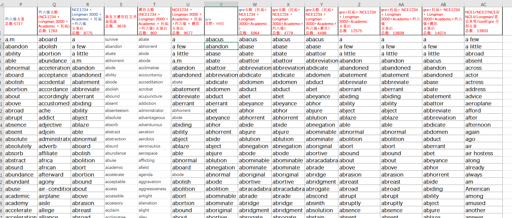

## **新概念2册学习笔记**

此文档来源于网络，整理的已经很详尽了，我在学习过程中也使用的此文档，所以就不重复造轮子了。

## **新概念3册学习笔记**

由于网络上没有好的笔记资料，我在现有的一套课件基础上又做了进一步的整理，持续更新中。

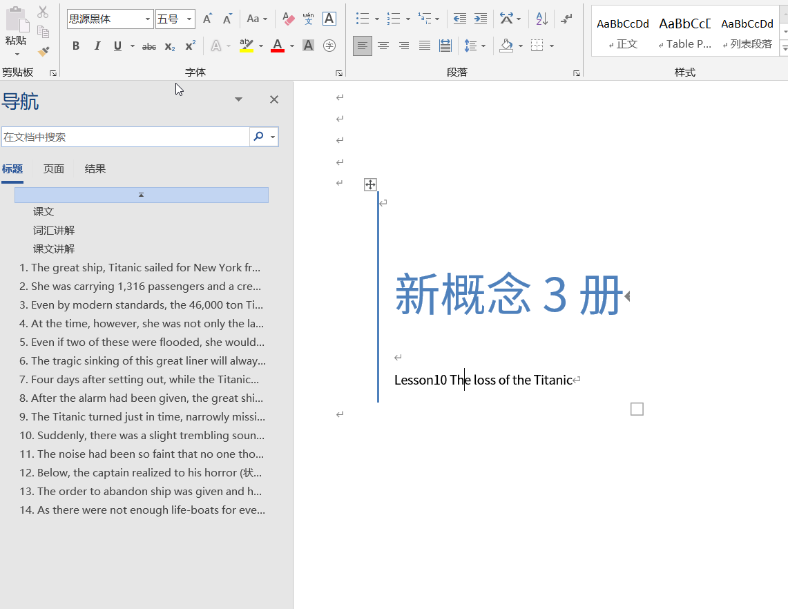
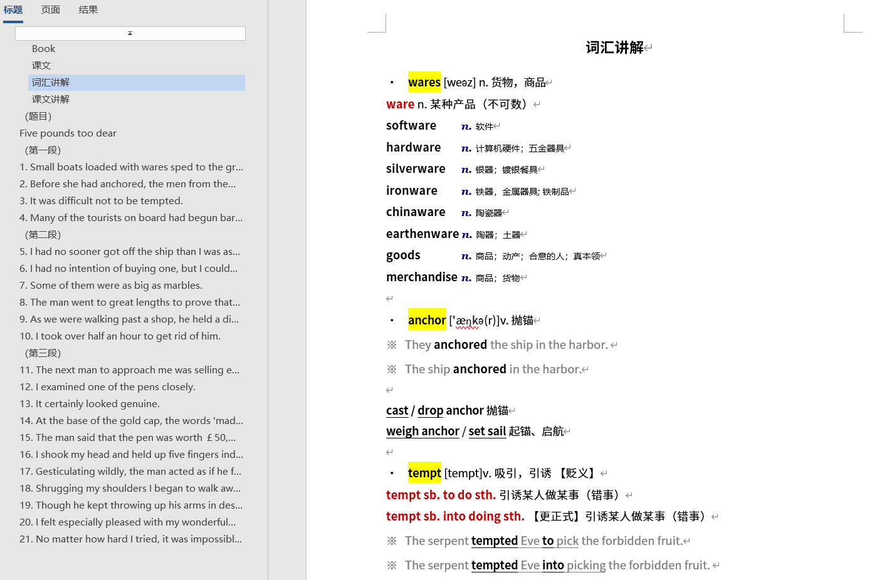
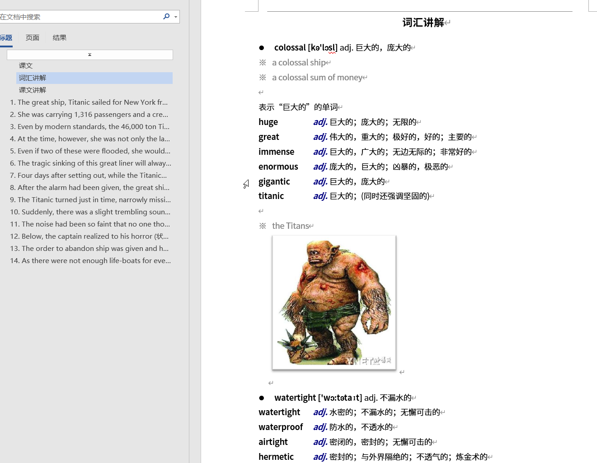
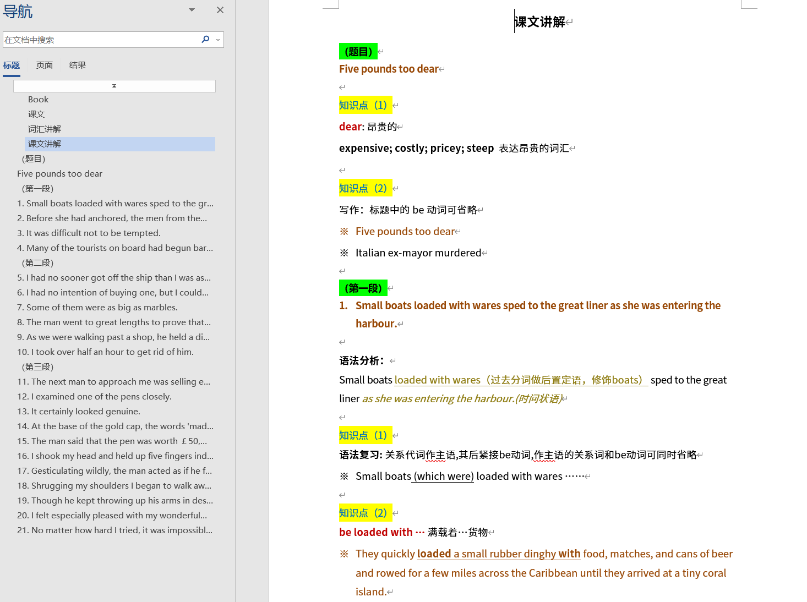
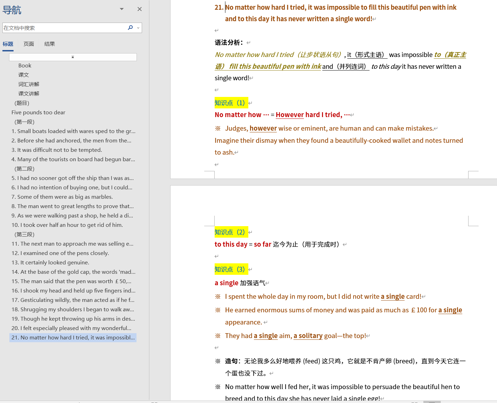

## **相应的Anki记忆资料**

[我的Anki分享主页](https://ankiweb.net/shared/byauthor/565817692) 

<https://ankiweb.net/shared/byauthor/565817692>

### **单词记忆卡片**

[Longman 3000 and Academic Words (English-Simplified Chinese)](https://ankiweb.net/shared/info/565817692)

[单词合集:整合了新概念，雅思，托福和四六级，共9500左右](https://ankiweb.net/shared/info/1323516802)

[新概念全四册单词](https://ankiweb.net/shared/info/2017522068)

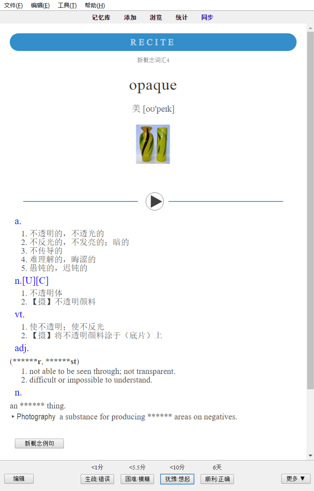

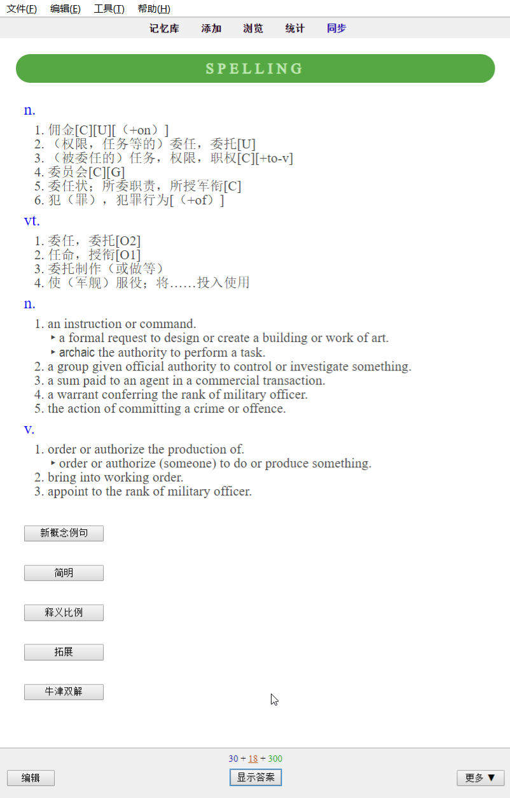

### **课文记忆卡片**

目前只维护3册课文带笔记
[新概念第三册课文 [按句子背诵,带笔记](https://ankiweb.net/shared/info/1533041577)

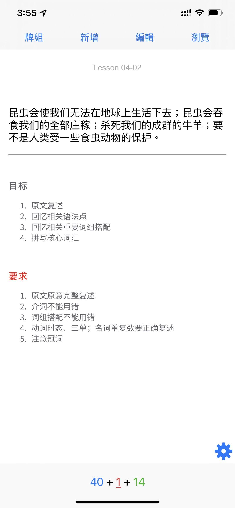
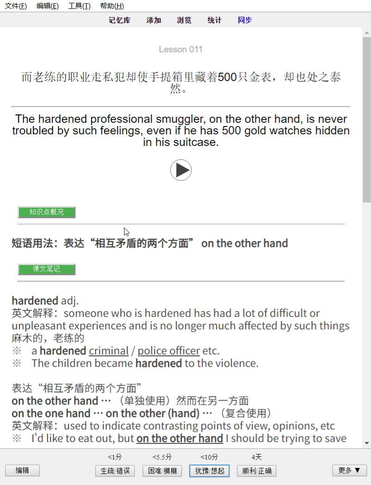
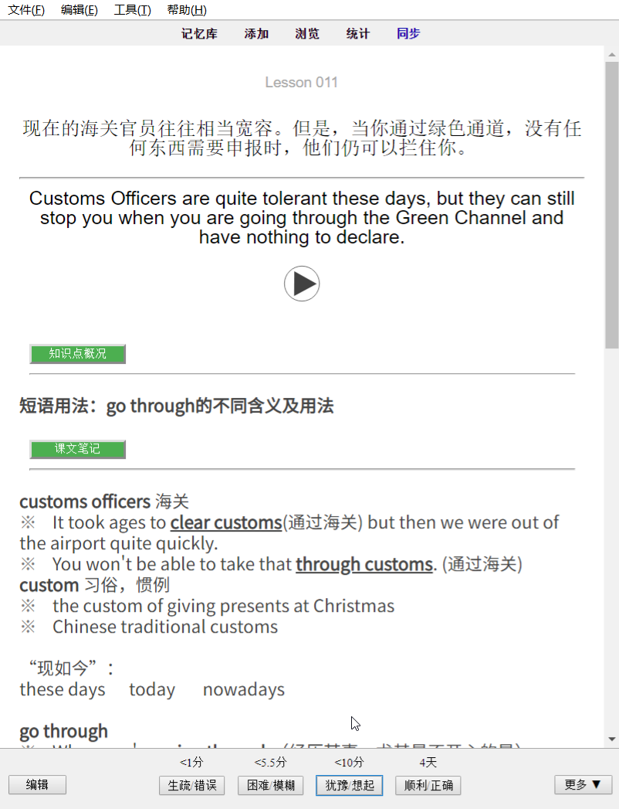